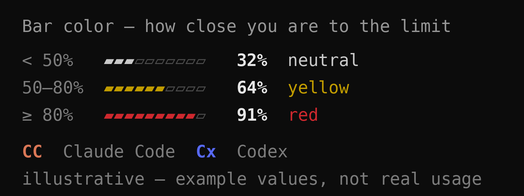

<div align="center">

# quotabar

**Claude Code + Codex 사용 한도를, 상태줄에서 바로.**

[English](./README.md) · [한국어](./README.ko.md)

<br>


<br>


</div>

[Claude Code](https://claude.com/claude-code) 상태줄(statusline)에 AI 코딩 **사용 한도** — 정액제에서 진짜 신경 쓰이는 **5시간 / 주간** 한도 —를 색 막대로 보여주는 작은 도구입니다. **[Claude Code](https://claude.com/claude-code)와 [Codex](https://github.com/openai/codex)를 나란히** 추적하고, 컨텍스트 %·모델·세션 비용도 함께 표시합니다.

**`bash` + `node`만 필요**(Claude Code가 이미 Node 사용) · **파일 하나** · **데몬 없음** · **네트워크 없음**.

```bash
curl -fsSL https://raw.githubusercontent.com/mangomandu/quotabar/main/install.sh | bash
```

<sub>Claude Code statusline으로 설치되며, 추가로 Codex의 로컬 세션 데이터를 읽어 두 에이전트의 한도를 한 곳에 모아줍니다. 새 세션을 열면 보입니다.</sub>

---

## ⚡ 엄청 가볍고 안전함 — 주장이 아니라 측정값

statusline은 **렌더마다** 도니까 거의 공짜여야 합니다. quotabar는 **세 가지 독립 검증**을 거쳤어요 — 적대적 리뷰 에이전트, **OpenAI Codex**, 그리고 속도 주장은 [**Verdikt**](https://github.com/mangomandu/verdikt)(holdout 기반 A/B 심판)로.

> **요약** — 평소 경로(캐시 적중)는 렌더당 **~6 ms / ~3.4 MB, Node를 아예 안 띄움** → `ccusage`보다 약 **5배 가벼움**. 데몬·타이머·소켓 없음. 세 검증 모두 익스플로잇 0개.

### 부하 — 렌더 1회당

기능이 아니라 *비용* 비교 — RunCat은 AI 사용량이 아니라 시스템 CPU 표시.

| | quotabar | `ccusage` statusline | RunCat |
|---|---|---|---|
| 종류 | statusline — 렌더마다 실행 | statusline — 렌더마다 실행 | **상주 메뉴바 앱** |
| 유휴 시 | **아무것도 안 함** | 아무것도 안 함 | 계속 실행(폴링+애니메이션) |
| 렌더당 시간 | **~6 ms** 캐시 적중 *(평소)* · ~32 ms 콜드 | ~32 ms | 상시 소량 CPU |
| 최대 메모리 | **~3.4 MB** 캐시 적중 *(node 안 뜸)* · ~45 MB 콜드 | ~48 MB | **계속 상주** |
| 네트워크 | **없음** | 없음 | 없음 |
| 상주 프로세스 | **없음** | 없음 | **항상 켜짐** |

- quotabar는 **세션별로 출력을 캐시**(기본 2초)해서 대부분의 렌더가 Node를 아예 안 띄움 → **~6 ms, ccusage보다 약 5배 가벼움**(ccusage는 매 렌더마다 Node 풀 기동).
- 콜드 렌더는 짧게 도는 `node` 하나(그중 ~22 ms가 Node 자체 기동) — ccusage와 동급.
- **데몬·타이머·소켓 없음.** 유휴 상태엔 진짜 아무것도 안 함 — 계속 폴링·애니메이션하는 상주 모니터(RunCat 등)와 반대.

> **Verdikt 판결** — 봉인 holdout, 페어 트라이얼, 부트스트랩 CI:
> ```
> ┌─ claim: quotabar(캐시 적중)가 ccusage보다 빠르다
> │  on sealed holdout: 100%  (95% CI 100%–100%)
> │  deflated (1 try): 100%
> └─ verdict: PASS ✅
> ```
> 트라이얼 평균: **quotabar 5.4 ms vs ccusage 29.6 ms.**

### 보안 — 적대적 감사(+Codex), 익스플로잇 0개

- **명령 주입 불가.** conf 로더의 `eval`은 `[A-Za-z0-9_]`로 검증된 키만 보고, 값은 `export`에 리터럴 인자로만 전달(절대 eval 안 거침). `$(...)`·백틱·`;cmd`·중괄호 탈출 전부 무효.
- **터미널 이스케이프 주입 불가.** 출력되는 모든 문자열(모델명·태그·Codex 파일경로·`Cx idle`·`│`·디버그)을 `clean()`이 C0/C1 제어바이트(`\x00–\x1f`, `\x7f–\x9f`)를 전부 제거. 악성 모델명·Codex 로그가 **ANSI/OSC 시퀀스(클립보드 탈취 OSC 52 등)를 터미널에 못 심음.**
- **경로 탈출 불가.** Codex 탐색은 심링크 디렉토리/파일을 건너뜀; 캐시 파일명은 `session_id`에서 검증; 깊이 제한.
- **유한.** 정규식 선형(ReDoS 없음); 막대 1–40, % 0–100 클램프; Codex tail 읽기 최대 4 MB.

---

## 화면 모습

> 전부 라이브 statusline의 실사 캡처 — 실제 사용량, 목업 아님.

**기본** — Claude Code와 Codex를 나란히, 브랜드 색(Claude 테라코타 / Codex 블루), 두 줄. 막대는 무채색이다가 **50%↑ 노랑**, **80%↑ 빨강**; `%`는 항상 흰색:


**넓은 터미널 → 한 줄** + `│` 구분선 (반응형, 자동):


**Codex가 `CC_USAGE_STALE_MIN`분 넘게 idle → 행이 접힘** (`Cx idle` 한 토막을 Codex 자리에 제자리로 — 한 줄·구분선 배치에서도 동작):


**막대 색** — 막대는 50% 미만 무채색, 50–80% 노랑, 80%+ 빨강. 위 3장은 실제 사용량(무채색/빨강 구간), 아래는 세 색을 한 번에 보여주는 **예시 값**:



---

## 왜?

`ccusage` 같은 도구는 **달러 비용**을 보여줍니다. 그런데 정액제에서 발목 잡는 건 **한도 %**와 **언제 리셋되는지** — 이 데이터가 이제 statusline의 stdin으로 들어옵니다. quotabar는 바로 그걸 보여주고, **Codex까지 묶는 유일한** 도구.

## 설치

**한 줄, 모든 OS 공통.** 터미널에 붙여넣으세요:

```bash
curl -fsSL https://raw.githubusercontent.com/mangomandu/quotabar/main/install.sh | bash
```

`~/.claude/hooks/`에 `statusline.sh`, 기본 `~/.claude/cc-usage.conf`를 깔고, `~/.claude/settings.json`에 `statusLine` 연결(기존 백업). 그다음 **새 Claude Code 세션을 열면**(또는 메시지 한 번 보내면) 보입니다. `bash`+`node`(둘 다 Claude Code에 이미 포함)와 `curl` 필요.

### OS별

| | 할 일 |
|---|---|
| 🍎 **macOS** | 터미널/iTerm에서 위 한 줄 실행이 끝. `bash`·`node`(Claude Code 동봉)·`curl` 다 이미 있어 추가 설치 없음. |
| 🐧 **Linux** | 같은 한 줄. 미니멀 환경이라 `curl`이 없으면: `sudo apt install curl`(Debian/Ubuntu) 또는 `sudo dnf install curl`(Fedora/RHEL) 후 실행. |
| 🪟 **Windows** | **WSL(Ubuntu 등) 안에서** 실행 — PowerShell/CMD 말고. quotabar는 bash 스크립트라서요. WSL 터미널 열고 한 줄 붙여넣고, Claude Code도 WSL 안에서 쓰세요. |

`curl`이 없으면 `wget`으로:

```bash
wget -qO- https://raw.githubusercontent.com/mangomandu/quotabar/main/install.sh | bash
```

**업데이트 / 제거** — 업데이트는 위 한 줄을 다시 실행(설정 유지) 또는 `bash ~/.claude/hooks/statusline.sh --update`. 제거는 `~/.claude/settings.json`의 `statusLine` 항목을 지우고 `~/.claude/hooks/statusline.sh` 삭제.

<details>
<summary>수동 설치 (스크립트 없이)</summary>

1. `statusline.sh` → `~/.claude/hooks/statusline.sh` (`chmod +x`)
2. `cc-usage.conf` → `~/.claude/cc-usage.conf`
3. `~/.claude/settings.json`에 추가:
   ```json
   "statusLine": { "type": "command", "command": "bash ~/.claude/hooks/statusline.sh", "padding": 0 }
   ```
</details>

> **Claude Code만 쓰는 경우.** 할 게 없습니다 — Codex 행은 기기에 Codex 세션 데이터가 있을 때만 보이고, 없으면 기본 상태에서 브랜드 색 Claude Code 두 줄(`5h`,`7d`)만 나옵니다.
>
> **`⏳ cc-usage: node not found`가 뜨면?** Claude Code를 통해 실행해 동봉 Node가 `PATH`에 오게 하거나, Node를 직접 설치하세요.

---

## 커스터마이즈

**파일 하나** `~/.claude/cc-usage.conf`만 고치면 됩니다(JSON X). `KEY=값` 한 줄씩, `#`는 주석. 저장 후 아무 메시지나 보내면 적용. 모든 키는 환경변수로도 가능(환경변수 우선).

#### 무엇을 / 몇 줄로 — `CC_USAGE_SEGMENTS`

이름 하나가 세그먼트 하나. `,`=같은 줄, `;`=줄바꿈. 자유롭게 섞어:

| 세그먼트 | 표시 |
|---|---|
| `5h` / `7d` | Claude Code 5시간 / 주간 사용량 — 막대 + % + 리셋 카운트다운 |
| `cx5h` / `cx7d` | Codex 5시간 / 주간 (로컬 Codex 세션 파일에서 읽음) |
| `ctx` | 컨텍스트 윈도우를 토큰 분수로, 예: `544k/1M` |
| `effort` | 추론 강도, 예: `max effort` (max일 때 `max` 글자 보라) |
| `model` | 모델명, 예: `Opus 4.8 (1M context)` |
| `cost` | 세션 비용, 예: `$1.42` |
| `sep` | `│` 구분선 |

```
CC_USAGE_SEGMENTS=5h,7d;cx5h,cx7d    # 기본 — Claude Code 줄 + Codex 줄
CC_USAGE_SEGMENTS=5h,7d              # Claude Code만
```

**model / effort / context 넣기** — 이름만 나열(별도 줄로 두거나 한 줄에 붙이거나):

```
CC_USAGE_SEGMENTS=5h,7d;cx5h,cx7d;model,effort,ctx   # 3번째 줄 추가: 모델 · effort · 토큰
CC_USAGE_SEGMENTS=5h,7d,model,effort,ctx             # 전부 한 줄
```

**빼기** — 목록에서 이름만 지우면 됨:

```
CC_USAGE_SEGMENTS=5h,7d;cx5h,cx7d;model              # model만 두고 effort·ctx 제거
CC_USAGE_SEGMENTS=ctx,model                          # 토큰 + 모델만
```

각 세그먼트는 독립 — 원하는 것만, 원하는 순서·줄에 배치. (`ctx` 분수에서 "ctx" 라벨 빼려면 `CC_USAGE_TAG_CTX=`를 빈 값으로 — 아래 참고.)

**반응형:** `CC_USAGE_SEGMENTS_WIDE`(기본 `5h,7d,sep,cx5h,cx7d`)는 터미널이 `CC_USAGE_WIDE_AT`칸(배포 기본 150; 한 줄 ≈ 134칸) 이상이면 적용, 좁으면 `CC_USAGE_SEGMENTS`. 폭은 Claude Code가 주는 `COLUMNS`에서 읽어 추가 프로세스 없음.

#### 라벨 & 색

머리말 = `[공급자 태그] [윈도우 태그]`, **모든 칸 교체 가능** — 아무 글자/이모지, 비우면 그 칸 생략:

```
CC_USAGE_TAG_CC=CC   CC_USAGE_TAG_CX=Cx                  # 공급자 라벨
CC_USAGE_TAG_5H=5h   CC_USAGE_TAG_7D=7d   CC_USAGE_TAG_CTX=ctx
# 이모지로:  TAG_CC=🟧  TAG_CX=🟦  TAG_5H=⏳  TAG_7D=📅
```

**공급자** 태그에 색 — 글자나 `✿ ⬢ ● ◆` 같은 단색 기호에 적용(🟧 같은 컬러 이모지는 색 무시):

```
CC_USAGE_TAGCOLOR_CC=claude   # 내장: Anthropic 테라코타 #da7756
CC_USAGE_TAGCOLOR_CX=codex    # 내장: Claude Code 컴팩팅 블루 #5769f7
```

우리가 쓴 두 브랜드 기본값:

| 태그 | 이름 | 값 | 정체 |
|---|---|---|---|
| `CC` | `claude` | `#da7756` | Anthropic 공식 **테라코타** 브랜드 색 |
| `Cx` | `codex`  | `#5769f7` | Claude Code의 **"compacting" 블루** — Codex는 공식 브랜드 색이 없어 이걸 차용 |

정하기 전엔 스크린샷에서 딴 후보가 둘 있었어요 — **Codex 홈페이지에서 따온 파랑** (`#293fe0`), 그리고 **코랄** (`#ff875f`, CSS `coral` 근처). 색은 내장 이름 / 256번호 / `#hex` / `rgb(r,g,b)` — 그 외 내장: `coral` `orange` `purple` `violet` `blue` `pink` `teal` `lime` `red` `yellow` `green` `cyan` `magenta` `gray` `white`.

#### 나머지 전부

| 키 | 하는 일 |
|---|---|
| `CC_USAGE_RESET` | `relative`(`4h00m`) · `clock`(`→18:40`) · `both` |
| `CC_USAGE_BARS` | 막대 칸, 1–40 (기본 10) |
| `CC_USAGE_WARN` / `CC_USAGE_CRIT` | 노랑 / 빨강 임계 % (기본 50 / 80) |
| `CC_USAGE_THRESHOLD=off` | 막대 색 끔 |
| `CC_USAGE_STYLE=ascii` | 막대를 `#-`로 · `NO_COLOR=1`은 색 끔 |
| `CC_USAGE_STALE_MIN` | Codex가 N분 유휴면 `Cx idle`로 접음 (기본 30; `0`=항상 풀) |
| `CC_USAGE_CODEX_DIR` | Codex 세션 읽을 경로 (기본 `~/.codex/sessions`) |
| `CC_USAGE_CACHE_TTL` | 세션별 출력 N초 재사용 (기본 2; `0`=항상 즉시 계산) |
| `CC_USAGE_UPDATE=on` | opt-in 업데이트 알림 (기본 **off**): `CC_USAGE_UPDATE_DAYS`마다 최대 1회 detached 백그라운드로 확인 후 새 버전이면 `⬆ vX.Y.Z` 표시 |
| `CC_USAGE_UPDATE_DAYS` | 위 확인 간격(일, 기본 7). 렌더 비용은 간격과 무관(타임스탬프 1회 읽기뿐) — 바뀌는 건 백그라운드 요청 빈도뿐 |

주석 달린 템플릿은 [`cc-usage.conf`](./cc-usage.conf) 참고.

**업데이트** — 아무 때나 [설치 명령](#설치)을 다시 실행하면 됨(`statusline.sh`만 덮어쓰고 설정은 유지), 또는 `bash ~/.claude/hooks/statusline.sh --update`로 1회 자가 갱신. `CC_USAGE_UPDATE=on`이면 새 버전 나올 때 바에 `⬆`가 떠서 알려줌. quotabar는 **렌더당 네트워크 호출이 0** — 알림 확인조차 throttle + detached라 핫패스엔 절대 안 올라옴(매 렌더 재해석하는 `npx pkg@latest`와 대조).

---

## 작동 방식

**quotabar는 네트워크 호출을 전혀 안 합니다 — 사용량을 어디서 "받아오는" 게 아니라, CLI가 이미 가진 데이터를 *표시*만 합니다.**

1. **Claude Code 한도** — 렌더할 때마다 Claude Code가 JSON 한 덩어리를 statusline 명령의 **stdin**으로 넘겨줍니다. 그 안에 이미 사용량 한도(`rate_limits.five_hour`/`seven_day`, 각각 `used_percentage` + epoch `resets_at`)와 `context_window`·`cost`·`model`이 들어 있음. quotabar는 그 값을 stdin에서 그대로 읽어 막대로 그릴 뿐, API를 직접 호출하지 않습니다. 그래서 숫자는 딱 Claude Code 자신의 데이터만큼만 최신입니다. (그 결과: 세션의 첫 메시지 전에는 Claude Code가 아직 `rate_limits`를 안 채워서, 뭔가 보내기 전까지 Claude Code 막대는 그냥 비어 있습니다.)
2. **Codex 한도** — **디스크**에서 읽음: `~/.codex/sessions/**/rollout-*.jsonl` 중 mtime 최신을 찾아 **끝부분만**(256KB→최대 4MB) 읽어 Codex가 마지막으로 쓴 `rate_limits`를 가져옵니다.
3. **레이아웃 & 캐시** — Claude Code가 넘겨주는 `COLUMNS`로 레이아웃을 고르고, 렌더 결과를 `(세션, 레이아웃)`별로 캐시.

전부 **짧게 도는 `node` 하나** 안에서(캐시 적중 시 0개) — `ls`/`grep`/`tail` 서브셸도, **네트워크도, 데몬도 없음**.

## 참고 / 한계

- **Codex 신선도** — quotabar는 Codex 한도를 Codex 자체 세션 로그에서 읽음 → **마지막으로 Codex가 돈 시점 그대로**라 quotabar가 대신 갱신 못 함. `CC_USAGE_STALE_MIN`분(기본 30) 넘게 안 돌면 행이 `Cx idle`로 접혀 멈춘 숫자를 안 보게 됨. (임계 시점 근처에선 동시에 열린 두 세션이 잠깐 다르게 보일 수 있음.)
- **반응형 지연** — statusline은 Claude Code가 다시 그릴 때(=활동) 재실행되지, 순수 터미널 resize엔 안 됨 — 그래서 창 크기 바꾼 뒤 **다음 동작** 때 레이아웃 전환. (계속 감시하려면 상주 데몬이 필요한데 의도적으로 피함.)
- **기호 태그** — 태그에 이모지·기호를 넣으면 일부 터미널이 컬러 이모지로 강제 렌더해 지정 `TAGCOLOR`를 무시함. 내 색을 입히려면 단색 딩뱃(`✿ ⬢ ● ◆`), 고정색 글리프를 원하면 컬러 이모지(🟧 🟦).

## 개발

`bash test.sh`로 테스트(어설션 41개; `bash`+`node` 필요). 진단은 `CC_USAGE_DEBUG=1 … bash statusline.sh`(또는 `--debug`) — 파싱된 데이터·적용 설정·고른 Codex 파일·신선도·인식 못한 `CC_USAGE_*` 키(오타)를 stderr로 출력.

## 라이선스

MIT
