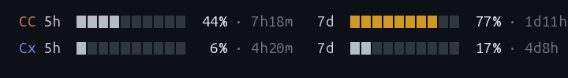
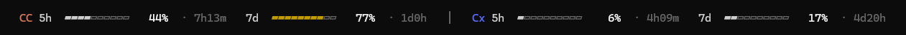
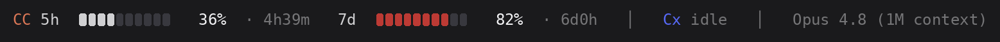

# quotabar

*[English](./README.md) · [한국어](./README.ko.md)*

A tiny [Claude Code](https://claude.com/claude-code) statusline that shows your AI coding **usage limits** — the 5-hour and weekly quota you actually care about on flat-rate plans — as colored bars. It tracks **Claude Code and [Codex](https://github.com/openai/codex) side by side**, plus context %, model, and session cost.



> It installs as a Claude Code statusline (that's the host) and additionally reads Codex's local session data, so both agents' limits live in one place.

`bash` + `node` only (Claude Code already ships Node). **One file. No daemon. No network.**

---

## ⚡ Lightweight & secure — measured, not claimed

This is the part that matters: a statusline runs on *every* render, so it has to be nearly free. quotabar was audited **three independent ways** — an adversarial review agent, **OpenAI Codex**, and [**Verdikt**](https://github.com/mangomandu/verdikt) (a holdout-based A/B referee) for the speed claim.

**Per render** (one statusline update):

| | quotabar — cache hit *(the common case)* | quotabar — cache miss | `ccusage statusline` |
|---|---|---|---|
| **time** | **~6 ms** | ~32 ms | ~32 ms |
| **peak memory** | **~3.4 MB** *(no Node spawned)* | ~45 MB | ~48 MB |
| **network** | **none** | none | none |
| **background process** | **none** | none | none |

- quotabar **caches its output per session** (default 2 s), so most renders skip Node entirely → **~6 ms, about 5× lighter than `ccusage`**, which pays full Node startup on every render.
- A cold render is a single short-lived `node` (~22 ms of which is Node's own startup) — on par with ccusage.
- **No daemon, no timer, no sockets.** It does literally nothing when you're idle — unlike always-on monitors (e.g. RunCat) that poll and animate continuously.

**Footprint vs other tools** (this compares *cost*, not features — RunCat shows system CPU, not AI usage):

| | quotabar | `ccusage` statusline | RunCat |
|---|---|---|---|
| type | statusline — runs per render | statusline — runs per render | **persistent menu-bar app** |
| when you're idle | **nothing runs** | nothing runs | runs continuously (polls + animates) |
| per update | **~5 ms** *(cache hit)* · ~32 ms cold | ~32 ms | continuous low CPU |
| memory | transient, freed (3.4–45 MB) | transient, freed (~48 MB) | **resident the whole time** |
| network | none | none | none |
| background process | **none** | none | **always-on daemon** |

> **Verdikt verdict** (sealed holdout, paired trials, bootstrap CI):
> ```
> ┌─ claim: quotabar (cache hit) renders faster than ccusage
> │  on sealed holdout: 100%  (95% CI 100%–100%)
> │  deflated (1 try): 100%
> └─ verdict: PASS ✅
> ```
> Average over the trials: **quotabar 5.4 ms vs ccusage 29.6 ms.**

**Security** — adversarial audit (and Codex), *no exploit found*:

- **No command injection.** The config loader's `eval` only ever sees keys sanitized to `[A-Za-z0-9_]`; values are passed as a literal argument to `export`, never to `eval`. `$(...)`, backticks, `;cmd`, brace-breakouts — all inert.
- **No terminal-escape injection.** Every rendered string (model name, tags, Codex file paths, the `Cx idle` token, the `│` divider, debug output) is run through `clean()`, which strips all C0/C1 control bytes (`\x00–\x1f`, `\x7f–\x9f`). A crafted model name or Codex log **cannot smuggle ANSI/OSC sequences** (e.g. clipboard-stealing OSC 52) onto your terminal.
- **No path traversal.** The Codex walk uses `readdirSync(withFileTypes)` and skips symlinked dirs/files; cache filenames are sanitized from `session_id`; depth is capped.
- **Bounded.** Regexes are linear (no ReDoS); bar width clamps to 1–40; percent clamps to 0–100; the Codex tail read is capped at 4 MB regardless of file size.

---

## What it looks like

**Default** — Claude Code only, plain text, zero config:


**Both providers**, brand-colored (Claude orange / Codex blue). Bars stay neutral, go **yellow past 50%** and **red past 80%**; the `%` is always white:


**Wide terminal → one line** with a `│` divider (responsive, auto):



**Codex idle a while → its row collapses** to a compact `Cx idle` tag after Claude Code:



---

## Why

`ccusage` and friends show the **dollar cost**. But on a flat-rate plan what bites you is the **limit %** and **when it resets** — and that data now arrives in the statusline's stdin. quotabar shows exactly that, and is the only one that folds in Codex too.

## Requirements

- `bash` and `node` (Claude Code already uses Node)
- Linux, macOS, or WSL

## Install

```bash
curl -fsSL https://raw.githubusercontent.com/mangomandu/quotabar/main/install.sh | bash
```

Drops `statusline.sh` into `~/.claude/hooks/`, adds a default `~/.claude/cc-usage.conf`, and wires up `statusLine` in `~/.claude/settings.json` (backing it up first). Open a new Claude Code session to see it.

<details>
<summary>Manual install</summary>

1. Copy `statusline.sh` to `~/.claude/hooks/statusline.sh` (`chmod +x`).
2. Copy `cc-usage.conf` to `~/.claude/cc-usage.conf`.
3. Add to `~/.claude/settings.json`:
   ```json
   "statusLine": { "type": "command", "command": "bash ~/.claude/hooks/statusline.sh", "padding": 0 }
   ```
</details>

## I only use Claude Code (no Codex)

Nothing to do — that's the default. You'll just see the two Claude Code rows (`5h`, `7d`); the Codex rows only appear if Codex session data exists on your machine.

## Customize

Edit **one file** — `~/.claude/cc-usage.conf` (no JSON). One `KEY=value` per line; `#` starts a comment. Save, then trigger any statusline refresh (type a message). Every key can also be an environment variable (which takes precedence).

**What to show & layout — `CC_USAGE_SEGMENTS`**
`,` puts items on the same line, `;` starts a new line. Items: `5h 7d` (Claude Code), `cx5h cx7d` (Codex), `ctx`, `model`, `cost`, `sep` (a `│` divider).
```
CC_USAGE_SEGMENTS=5h,7d              # default
CC_USAGE_SEGMENTS=5h,7d;cx5h,cx7d    # Claude Code row + Codex row
```
**Responsive:** set `CC_USAGE_SEGMENTS_WIDE` (e.g. `5h,7d,sep,cx5h,cx7d`) to use a wider layout when the terminal is at least `CC_USAGE_WIDE_AT` columns (default 120), else `CC_USAGE_SEGMENTS`. Width comes from the `COLUMNS` env Claude Code provides — no extra process.

**Labels & colors**
Head = `[provider tag] [window tag]`. Defaults are plain text; put any text or emoji, and color the tag (text or a monochrome symbol like `✿ ⬢ ● ◆`):
```
CC_USAGE_TAG_CC=CC          CC_USAGE_TAGCOLOR_CC=claude   # built-in: claude orange #d77757
CC_USAGE_TAG_CX=Cx          CC_USAGE_TAGCOLOR_CX=codex    # built-in: codex blue #5769f7
```
Colors accept a name (`claude`, `codex`, `orange`, `purple`, …), a 256-index, `#hex`, or `rgb(r,g,b)`.

**Reset display — `CC_USAGE_RESET`**: `relative` (`4h00m`) · `clock` (`→18:40`) · `both`

**Appearance**: `CC_USAGE_BARS` (cells, 1–40) · `CC_USAGE_WARN`/`CC_USAGE_CRIT` (yellow/red %) · `CC_USAGE_THRESHOLD=off` (never color bars) · `CC_USAGE_STYLE=ascii` (bars as `#-`) · `NO_COLOR=1`

**Codex collapse — `CC_USAGE_STALE_MIN`** (default 30): if Codex hasn't run in N minutes, its rows collapse to a compact `Cx idle` tag. `0` = always show full rows.

**Cache — `CC_USAGE_CACHE_TTL`** (default 2): reuse output for N seconds per session. `0` = always recompute.

See [`cc-usage.conf`](./cc-usage.conf) for the annotated template.

## How it works

On each render Claude Code pipes a JSON blob to the command. quotabar reads `rate_limits` (`five_hour` / `seven_day`, with `used_percentage` + epoch `resets_at`), plus `context_window`, `cost`, `model`. For Codex it finds the newest `~/.codex/sessions/**/rollout-*.jsonl` by mtime and reads just the tail (growing 256 KB → 4 MB) to pull the last `rate_limits` event. It reads `COLUMNS` to pick the layout, then caches the result per `(session, layout)`. Everything happens in **one short-lived `node` process** (zero on a cache hit) — no `ls`/`grep`/`tail` subprocesses, no network.

## Notes & limitations

- **Codex freshness**: Codex values reflect the last time Codex ran (that's when it writes them); quotabar can't refresh them itself. When it hasn't run in `CC_USAGE_STALE_MIN` minutes its row collapses to `Cx idle`.
- **Responsive lag**: the statusline re-runs when Claude Code re-renders (on activity), not on a bare terminal resize — so after resizing, the layout switches on your next action. (Watching the terminal continuously would require a persistent daemon, which this deliberately avoids.)
- **Terminal glyphs**: some terminals force emoji presentation on symbols like ☁ (ignoring color). Use plain dingbats (`✿ ⬢ ● ◆`) for reliable custom colors, or colored emoji (🟧 🟦).

## Development

Run `bash test.sh` for the test suite (18 assertions; needs `bash` + `node`). For diagnostics, `CC_USAGE_DEBUG=1 … bash statusline.sh` (or `--debug`) prints the parsed data, resolved config, chosen Codex file + freshness, and any unknown `CC_USAGE_*` keys (typos) to stderr.

## License

MIT
