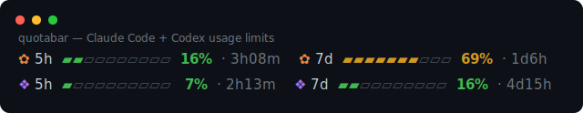

# quotabar

*[English](./README.md) · [한국어](./README.ko.md)*

A tiny [Claude Code](https://claude.com/claude-code) statusline that shows your AI coding **usage limits** — the 5-hour and weekly quota you actually care about on flat-rate plans — as colored bars. It tracks **[Claude Code](https://claude.com/claude-code) and [Codex](https://github.com/openai/codex) side by side**, plus context %, model, and session cost.



> It installs as a Claude Code statusline (that's the host), and additionally reads Codex's local session data so both agents' limits show in one place.

No dependencies beyond `bash` + `node` (which Claude Code already needs). One file, one short-lived `node` process per render.

```
CC 5h  ▰▰▱▱▱▱▱▱▱▱   16%  · 3h08m   CC 7d  ▰▰▰▰▰▰▰▱▱▱   69%  · 1d7h
```

Run both Claude Code and Codex? Show them together:

```
✿ 5h  ▰▰▱▱▱▱▱▱▱▱   16%  · 3h08m   ✿ 7d  ▰▰▰▰▰▰▰▱▱▱   69%  · 1d7h     ← Claude Code
⬢ 5h  ▱▱▱▱▱▱▱▱▱▱    4%  · 2h45m   ⬢ 7d  ▰▰▱▱▱▱▱▱▱▱   16%  · 4d15h    ← Codex
```

Bars turn **yellow** past 50% and **red** past 80%.

## Why

`ccusage` and similar tools show the **dollar cost**. But on a flat-rate plan what bites you is the **limit %** and **when it resets** — and that data now arrives in the statusline's stdin. This shows exactly that, and is the only one that folds in Codex too.

## Requirements

- `bash` and `node` (Claude Code already uses Node)
- Works on Linux, macOS, and WSL

## Install

```bash
curl -fsSL https://raw.githubusercontent.com/mangomandu/quotabar/main/install.sh | bash
```

This drops `statusline.sh` into `~/.claude/hooks/`, adds a default `~/.claude/cc-usage.conf`, and wires up `statusLine` in `~/.claude/settings.json` (backing it up first). Open a new Claude Code session to see it.

<details>
<summary>Manual install</summary>

1. Copy `statusline.sh` to `~/.claude/hooks/statusline.sh` (`chmod +x` it).
2. Copy `cc-usage.conf` to `~/.claude/cc-usage.conf`.
3. Add to `~/.claude/settings.json`:
   ```json
   "statusLine": { "type": "command", "command": "bash ~/.claude/hooks/statusline.sh", "padding": 0 }
   ```
</details>

## I only use Claude Code (no Codex)

Nothing to do — that's the default. You'll just see the two Claude Code rows (`5h`, `7d`); the Codex rows only appear if Codex session data exists on your machine. If you ever want to be explicit, keep this line in your config:

```
CC_USAGE_SEGMENTS=5h,7d
```

## Customize

Edit **one file** — `~/.claude/cc-usage.conf` (no JSON). One `KEY=value` per line; `#` starts a comment. Save, then trigger any statusline refresh (type a message) to apply. Every key can also be set as an environment variable, which takes precedence.

**What to show & layout — `CC_USAGE_SEGMENTS`**
`,` puts items on the same line, `;` starts a new line. Items: `5h 7d` (Claude Code), `cx5h cx7d` (Codex), `ctx`, `model`, `cost`, `sep` (a `│` divider).
```
CC_USAGE_SEGMENTS=5h,7d              # default: Claude Code on one line
CC_USAGE_SEGMENTS=5h,7d;cx5h,cx7d    # Claude Code row + Codex row
CC_USAGE_SEGMENTS=5h,7d;cx5h,cx7d;ctx,cost
```
**Responsive:** set `CC_USAGE_SEGMENTS_WIDE` (e.g. `5h,7d,sep,cx5h,cx7d`) to use a wider layout when the terminal is at least `CC_USAGE_WIDE_AT` columns (default 120); otherwise `CC_USAGE_SEGMENTS` is used. Width comes from the `COLUMNS` env Claude Code provides — no extra process.

**Labels — four free slots**
Head = `[provider tag] [window tag]`. Defaults are plain text; put any text or emoji. The provider tag shows once per line — a second same-provider window (e.g. the `7d` after `CC 5h`) drops it.
```
CC_USAGE_TAG_CC=✿        # "CC" slot   (default: CC)
CC_USAGE_TAG_CX=⬢        # "Cx" slot   (default: Cx)
CC_USAGE_TAG_5H=⏳        # "5h" slot   (default: 5h)
CC_USAGE_TAG_7D=📅        # "7d" slot   (default: 7d)
CC_USAGE_TAGCOLOR_CC=claude    # colors the provider tag (text or symbol ✿ ⬢ ● ◆ …)
CC_USAGE_TAGCOLOR_CX=codex     # name (claude/codex built in), 256-index, #hex, or rgb(); emoji (🟧) ignore it
```

**Reset display — `CC_USAGE_RESET`**: `relative` (`4h00m`) · `clock` (`→18:40`) · `both`

**Appearance**: `CC_USAGE_BARS` (cells) · `CC_USAGE_WARN`/`CC_USAGE_CRIT` (% thresholds) · `CC_USAGE_THRESHOLD=off` (never color bars; default is neutral, yellow past WARN, red past CRIT; % stays white) · `CC_USAGE_STYLE=ascii` (bars as `#-`) · `NO_COLOR=1`

**Performance / freshness**: `CC_USAGE_CACHE_TTL` (reuse output for N seconds per session, default `2`, `0` to disable) · `CC_USAGE_STALE_MIN` (when Codex hasn't run in N minutes, collapse its rows into a compact `Cx idle` tag after Claude Code; default `30`, `0` to disable)

See [`cc-usage.conf`](./cc-usage.conf) for the annotated template.

## How it works

On each render Claude Code pipes a JSON blob to the statusline command. This script reads `rate_limits` (`five_hour` / `seven_day`, with `used_percentage` and an epoch `resets_at`), plus `context_window`, `cost`, and `model`. For Codex, it finds the newest session rollout under `~/.codex/sessions/**/rollout-*.jsonl` and reads just the tail to pull the last `rate_limits` event (`primary` = 5h, `secondary` = weekly).

Everything happens in **one short-lived `node` process** — no `ls`/`grep`/`tail` subprocesses, and Codex is read only when `cx*` segments are enabled. Typical overhead is ~20 ms per render (almost entirely Node startup), and Claude Code only re-runs it on activity, so it's effectively free.

## Performance & footprint

quotabar has **no daemon, no timer, no autostart**. It runs only when Claude Code re-renders the statusline (throttled to ~once per 300 ms, and only on activity), then exits. When you're idle, it does nothing.

Measured per render:

- **CPU**: ~20 ms on one core — almost entirely Node startup (V8 init). Bursty during activity, **0 when idle**.
- **RAM**: ~47 MB transient for the Node process, **freed on exit** — nothing stays resident, no leak.
- **Network / Ethernet**: **none** — it only reads stdin and local files; there is no socket or HTTP code at all.
- **Disk**: negligible (the config, plus ≤256 KB from the tail of one Codex session file, and only when `cx*` rows are enabled).

Compared to an always-on monitor like [RunCat](https://kyome.io/runcat/) (a menu-bar app that continuously polls CPU and animates an icon):

| | quotabar | RunCat-style resident monitor |
|---|---|---|
| Model | event-driven; runs only on render | persistent daemon + its own timer |
| Idle | **0** (nothing runs) | continuous small CPU + wakeups |
| RAM | transient, freed on exit | held resident the whole time |
| Network | none | none |
| Battery | no idle wakeups → friendly | constant animation → slight drain |

It also **caches its output per session for `CC_USAGE_CACHE_TTL` seconds** (default 2), so rapid re-renders during streaming reuse the last line instead of spawning Node — in practice ~1 Node spawn every couple of seconds instead of one per render. Editing the config bypasses the cache, so changes still show up immediately.

**Honest downside:** each (uncached) render spawns a fresh `node` (the ~20 ms startup), so per update it does more work than a long-lived app's in-process tick — but it fires far less often and never when idle. Under continuous streaming the throttle plus the cache cap it at roughly one `node` spawn every TTL seconds, dropping to zero the moment you stop. This Node-startup cost is shared by any Node-based statusline (e.g. `ccusage`); quotabar just avoids the extra `ls`/`grep`/`tail` subprocesses on top.

## Notes & limitations

- **Codex freshness**: Codex values reflect the last time Codex ran (that's when it writes the data). When Codex hasn't run in `CC_USAGE_STALE_MIN` minutes (default 30), its rows collapse into a compact `Cx idle` tag appended after Claude Code (e.g. `… 7d … 74% · 1d2h   Cx idle`), so a stale Codex doesn't take a full row or imply live numbers. quotabar can't refresh Codex itself — only Codex writes that data when it runs — so this just reports the staleness honestly.
- **Terminal glyphs**: some terminals force emoji presentation on symbols like ☁, ignoring color. Stick to plain dingbats (`✿ ⬢ ● ◆`) for reliable custom colors, or use colored emoji squares (🟧 🟪).
- **Refresh cadence**: Claude Code re-runs the statusline on activity (throttled), so the % tracks near-real-time, not as a live ticking counter.

## Development

Run `bash test.sh` to execute the test suite (11 assertions; needs `bash` + `node`).

For diagnostics, run `CC_USAGE_DEBUG=1 … bash statusline.sh` (or `bash statusline.sh --debug`): it prints the parsed `rate_limits`, the resolved config and tags, the chosen Codex file and its freshness, and any unknown `CC_USAGE_*` keys (typos) to stderr.

## License

MIT
